## 

:::::::::::::::: {style="display:flex; width:100%; height:80vh; align-items:center;"}
:::::::::::::: {style="width:60%; text-align:left; padding-left:40px;"}
::: {style="font-size:46px; font-weight:800; color:#003A70; margin-bottom:20px; line-height:1.15;"}
Outlier Detection in Spatio-Temporal Data
:::

::: {style="font-size:36px; font-weight:650; color:#2c3e50; margin-bottom:70px; letter-spacing:0.4px; line-height:1.2;"}
Geospatial Statistics and Health Surveillance Research Group
:::

::::::::::: {style="line-height:1.35;"}
::: {style="font-size:30px; font-weight:800; color:#000000; margin-bottom:6px;"}
Mohammad Saqib Ansari
:::

::: {style="font-size:19px; color:#444444; margin-bottom:4px;"}
PhD Student in Statistics
:::

::: {style="font-size:19px; color:#444444; margin-bottom:4px;"}
King Abdullah University of Science and Technology (KAUST), Saudi Arabia
:::

::: {style="color:#1E5AA8; font-size:18px; margin-bottom:36px;"}
mohammad.ansari\@kaust.edu.sa
:::

::: {style="font-size:30px; font-weight:800; color:#000000; margin-bottom:6px;"}
Prof. Paula Moraga
:::

::: {style="font-size:19px; color:#444444; margin-bottom:4px;"}
Professor of Statistics
:::

::: {style="font-size:19px; color:#444444; margin-bottom:4px;"}
King Abdullah University of Science and Technology (KAUST), Saudi Arabia
:::

::: {style="color:#1E5AA8; font-size:18px;"}
paula.moraga\@kaust.edu.sa
:::
:::::::::::
::::::::::::::

::: {style="width:40%; text-align:center;"}
```{=html}

```

<br>

```{=html}

```
:::
::::::::::::::::

##  {background-color="#000000"}

::: {style="height:80vh; display:flex; justify-content:center; align-items:center; font-size:64px; font-weight:700; color:white; letter-spacing:2px;"}
Outlier
:::

# What is Outlier?

::: fragment
An outlier is an observation that differs so much from other observations as to arouse suspicion that it was generated by a different mechanism [@WikipediaAnomalyDetection].
:::

::: fragment
{width="80%" fig-align="center"}
:::

## Outlier in 1-Dimension

::: fragment
In one dimension, an observation is considered an outlier if it is unusually large or unusually small compared to the remaining observations.
:::

::: fragment
### Methods to Detect Outliers
:::

::: fragment
-   Z-score Method
:::

::: fragment
-   IQR (Interquartile Range) Method
:::

::: fragment
-   Boxplot Method
:::

::: fragment
-   Median Absolute Deviation (MAD)
:::

[@AgrestiKateri2021]

## Outlier in 2-Dimension

::: fragment
Outliers in two dimensions can be analyzed using graphical and quantitative approaches.
:::

:::::: fragment
::::: {style="display:flex; gap:60px;"}
::: {style="width:50%;"}
### Graphical Methods

-   Moran Scatter Plot\
-   Scatter Plot\
-   Variogram Cloud
:::

::: {style="width:50%;"}
### Quantitative Methods

-   Spatial Statistics\
-   Cook’s Distance\
-   Leverage (Hat Values)\
-   Studentized Residuals\
-   Mahalanobis Distance\
-   DFFITS\
-   DFBETAS
:::
:::::
::::::

[@shekhar2003spatial; @kutner2004applied]

# Defining Outliers

::::::::::::::: columns
:::::: {.column width="33%"}
::::: fragment
```{=html}
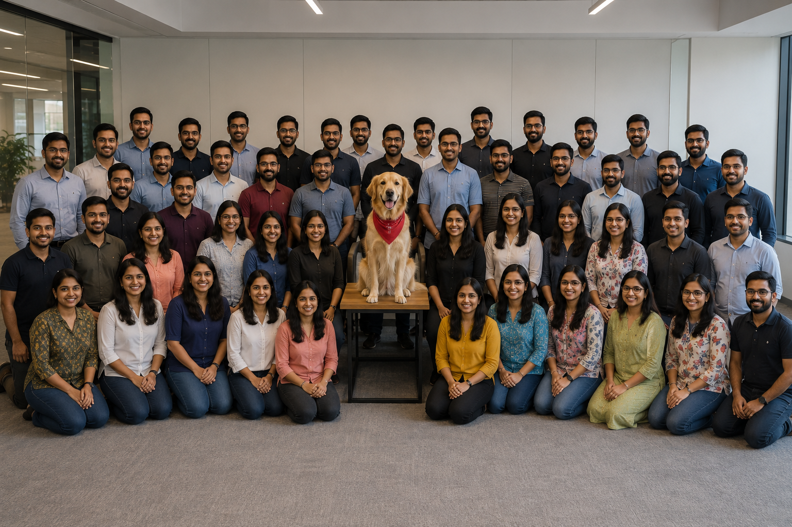
```

::: {style="font-size:24px; font-weight:700; margin-top:12px; text-align:center;"}
Different Object
:::

::: {style="font-size:16px; line-height:1.25; margin-top:8px; text-align:center;"}
A dog among cats can be considered an outlier because it differs substantially from the majority group.
:::
:::::
::::::

:::::: {.column width="33%"}
::::: fragment
```{=html}
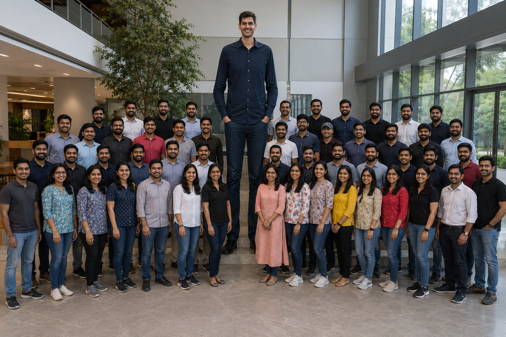
```

::: {style="font-size:24px; font-weight:700; margin-top:12px; text-align:center;"}
Extreme Height
:::

::: {style="font-size:16px; line-height:1.25; margin-top:8px; text-align:center;"}
An extremely tall individual compared to the surrounding population may represent an outlier.
:::
:::::
::::::

:::::: {.column width="33%"}
::::: fragment
```{=html}
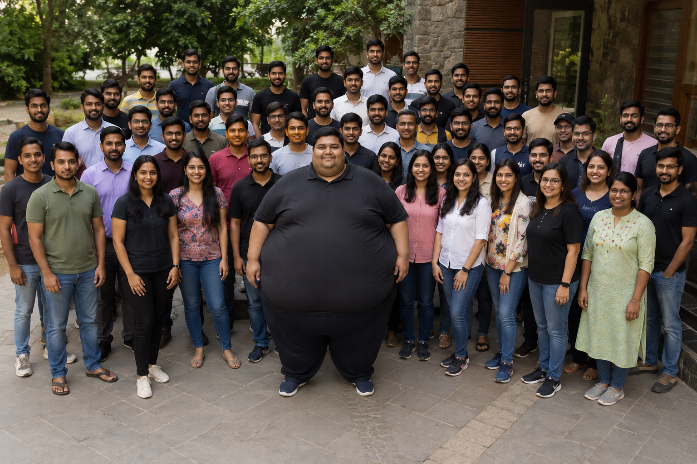
```

::: {style="font-size:24px; font-weight:700; margin-top:12px; text-align:center;"}
Distinct Observation
:::

::: {style="font-size:16px; line-height:1.25; margin-top:8px; text-align:center;"}
An observation that differs strongly from the majority pattern can be flagged as an outlier.
:::
:::::
::::::
:::::::::::::::

::: {style="font-size:13px; margin-top:18px; text-align:right;"}
Images generated for illustrative purposes.
:::

##  {background-color="#000000"}

::: {style="height:80vh; display:flex; justify-content:center; align-items:center; font-size:64px; font-weight:700; color:white; letter-spacing:2px;"}
Definitions
:::

## 1. Amplitude Outliers

An amplitude outlier is a functional observation that follows a similar overall shape as the majority of curves but has unusually large or small magnitude variations.

$$
y(t) = a\,\mu(t)
$$

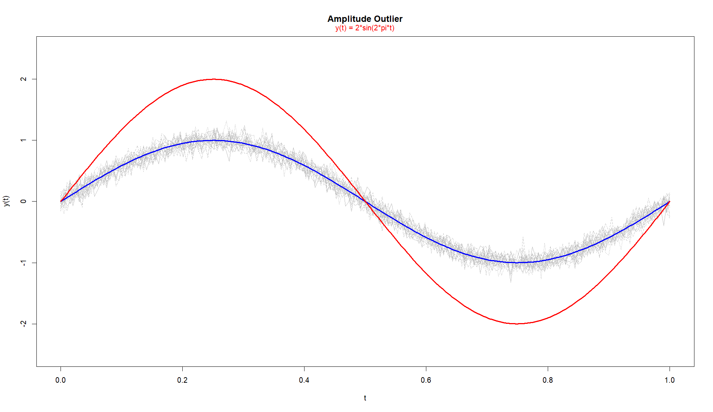{width="100%" fig-align="center"}

## 2. Magnitude Outliers

A magnitude outlier is a functional observation whose values are consistently larger or smaller than the central function while preserving a similar shape.

$$
y(t) = \mu(t) + c
$$

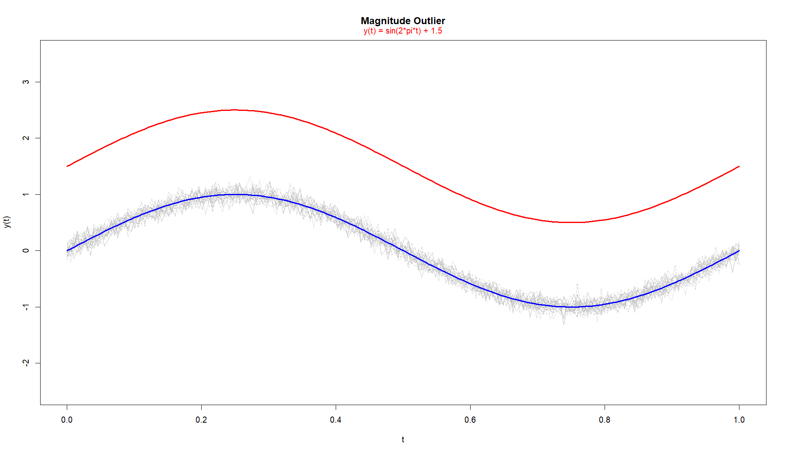{width="100%" fig-align="center"}

## 3. Shape Outliers

A shape outlier is a functional observation whose overall pattern or shape differs from the central tendency of the sample, regardless of its magnitude or amplitude.

$$ 
y(t) \not\approx a \cdot \mu(t) + c
$$

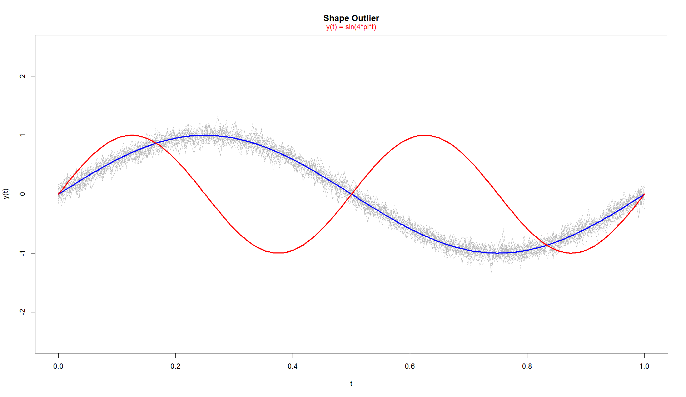{width="100%" fig-align="center"}

## 4. Trend Outliers

Trend outliers are curves that exhibit unusual temporal patterns compared to the majority of observations in the dataset.

| Type              | Example                                  |
|-------------------|------------------------------------------|
| Linear trend      | $a + bt$                                 |
| Polynomial trend  | $a + bt + ct^{2}$                        |
| Exponential trend | $ae^{bt}$                                |
| Cyclic trend      | Repeated periodic fluctuations over time |

## 4. Trend Outliers

<br>

::::::::: columns
::::: {.column width="50%"}
:::: fragment
```{=html}
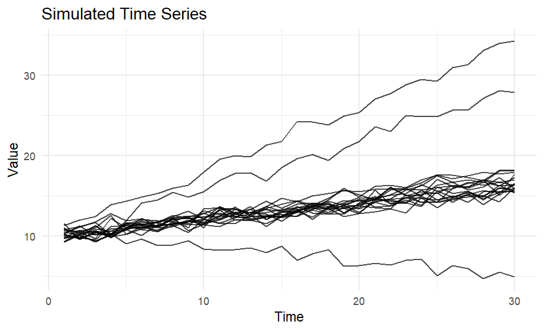
```

::: {style="text-align:center; font-size:16px; margin-top:10px;"}
Simulated time series illustrating different trends.
:::
::::
:::::

::::: {.column width="50%"}
:::: fragment
```{=html}
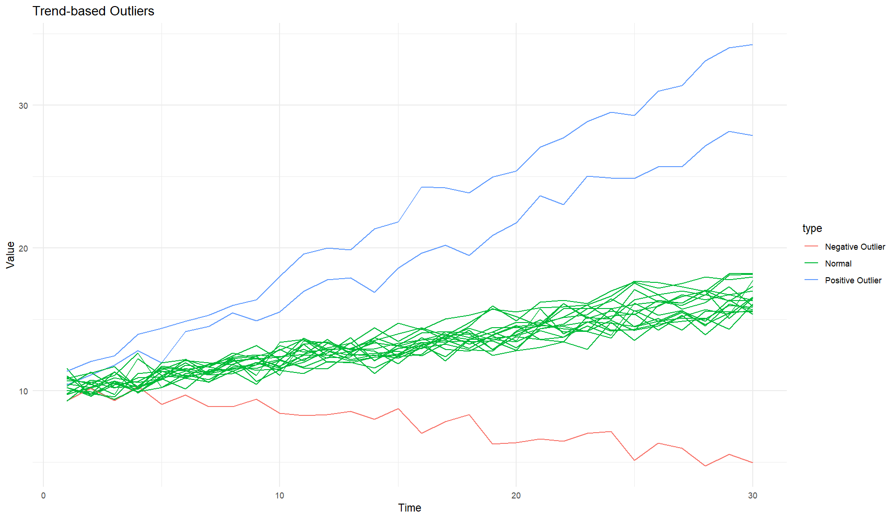
```

::: {style="text-align:center; font-size:16px; margin-top:10px;"}
Examples of baseline linear trend patterns.
:::
::::
:::::
:::::::::

<br>

:::: fragment
::: {style="font-size:20px; text-align:center;"}
A linear trend is fitted to each curve, and observations with slope values below the 5th percentile or above the 95th percentile are identified as outliers.
:::
::::

## 5. Depth Outliers

::: fragment
A data depth concept can be viewed as a generalization of quantiles to multivariate data.\
It measures the centrality (depth) of a given point in $\mathbb{R}^n$, assuming\
$X_1, \ldots, X_k$ is a random sample from $\mathbb{R}^n$ [@Dyckerhoff2020ProjectionDepth; @TuftsDataDepth]
:::

<br>

:::: fragment
### Mahalanobis Depth

$$
D_M(x)=\frac{1}{1+(x-\mu)^\top \Sigma^{-1}(x-\mu)}
$$ [@Dyckerhoff2020ProjectionDepth]

::: {style="font-size:18px; margin-top:10px;"}
Here, $\mu$ and $\Sigma$ denote the mean vector and covariance matrix, respectively. Larger depth values indicate more central observations.
:::
::::

------------------------------------------------------------------------

## 5.1 Mahalanobis Depth

::: fragment
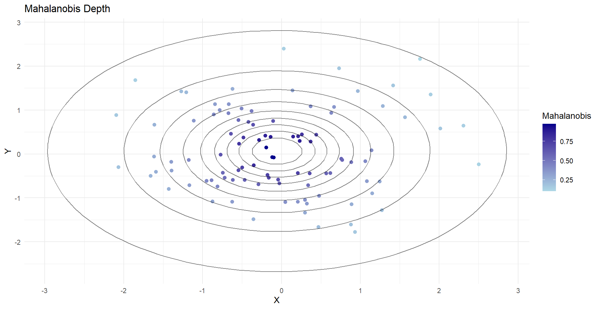{width="75%" fig-align="center"}
:::

------------------------------------------------------------------------

## 5.2 Tukey Depth [@tukey1975picturing]

::: fragment
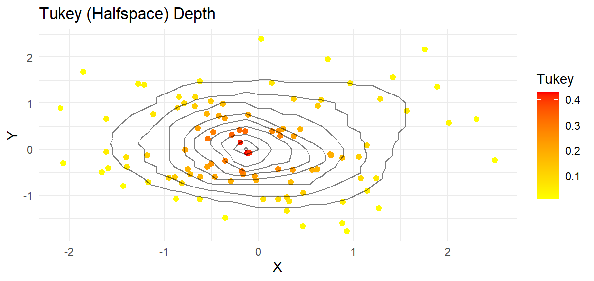{width="75%" fig-align="center"}
:::

------------------------------------------------------------------------

## 5.3 Spatial Depth [@Nagy2017MonotonicitySpatialDepth]

::: fragment
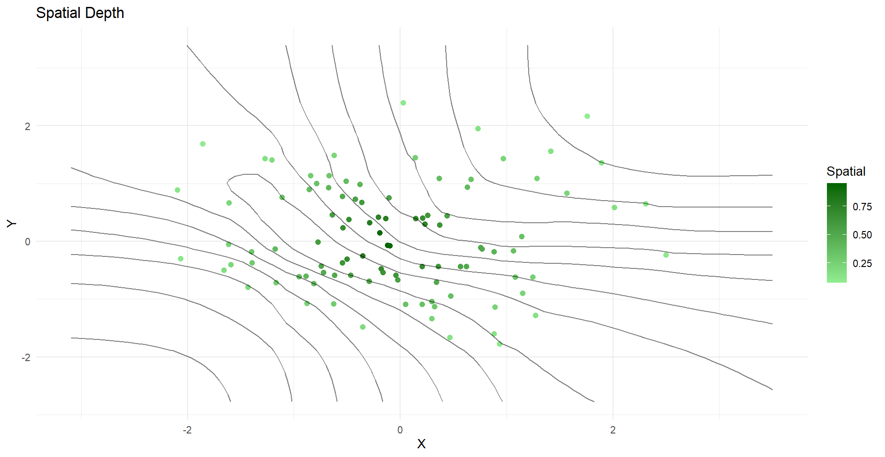{width="75%" fig-align="center"}
:::

## 5.1 Illustration of Outlier Dtection using Malhanobis Depth

::::::: columns
:::: {.column width="50%"}
::: fragment
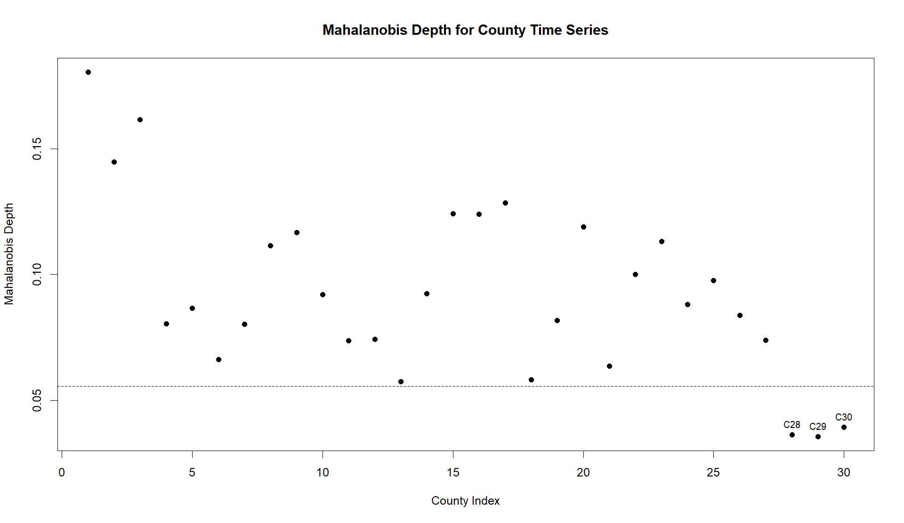{width="100%"}

Depth values calculated for different curves. Small depths values are considered outliers
:::
::::

:::: {.column width="50%"}
::: fragment
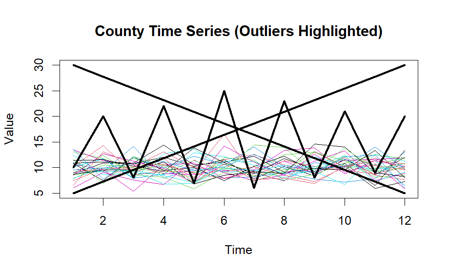{width="100%"}

The plots of curves and outliers highligted in black .
:::
::::
:::::::

## 6. Frequency Outlier

Frequency outliers are curves whose oscillation frequency differs significantly from that of the majority of curves in the dataset.

::: fragment
$$
y(t)=\sin(2\pi f t)
$$

where (f) denotes the oscillation frequency.

$$
f=\frac{1}{T}
$$

where (T) is the period of oscillation.
:::

## 6. Illustration of Frequency Outliers

::::::: columns
:::: {.column width="50%"}
::: fragment
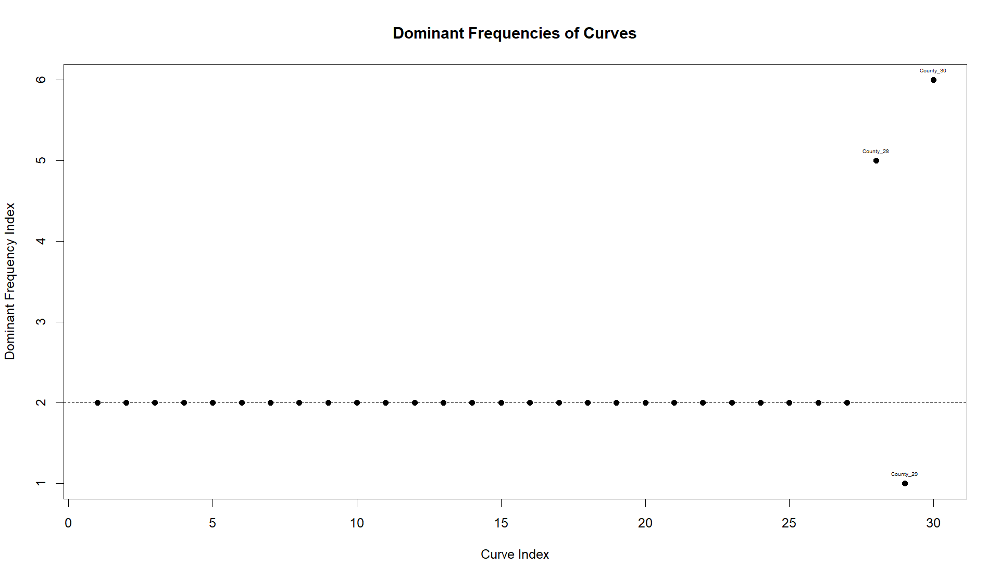{width="100%"}

Dominant frequency estimated for each county using spectral analysis.
:::
::::

:::: {.column width="50%"}
::: fragment
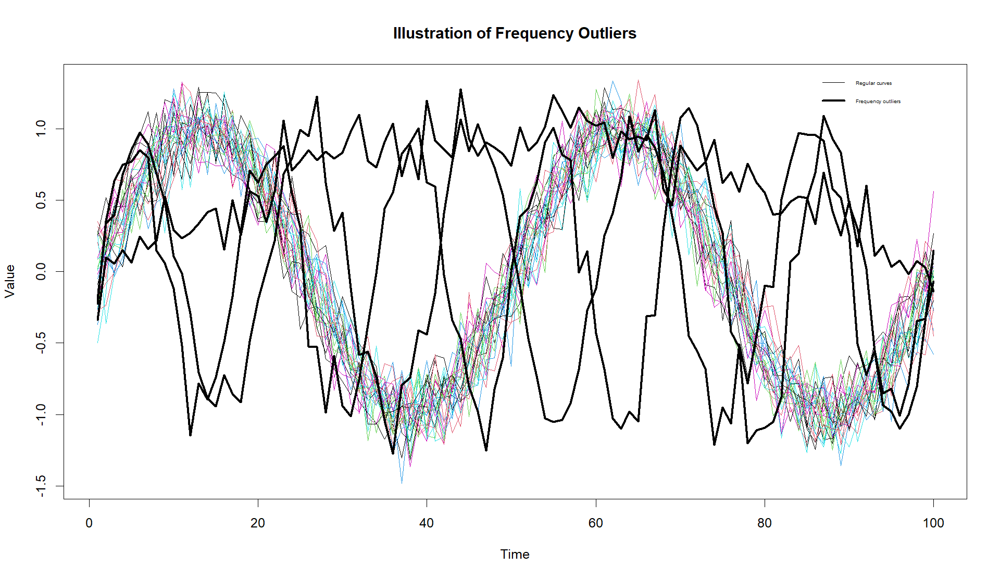{width="100%"}

Highlighted curves correspond to counties whose oscillation frequencies differ substantially from the majority of curves.
:::
::::
:::::::

## 7. Distance Outlier

Distance outliers are functional observations whose distance from a central reference curve, such as the mean or median curve, is unusually large or unusually small compared to the majority of curves in the dataset.

::: fragment
$$
d_i = d\!\left(y_i(t),\, \mu(t)\right)
$$

where $mu(t)$ denotes the central curve and $d_i$is the distance measure.
:::

::: fragment
$$
d_i > Q_{1-\alpha}
$$

may be classified as a distance outlier, where $Q_{1-\alpha}$ denotes the $(1-\alpha)$-quantile of the distance distribution.
:::

------------------------------------------------------------------------

::::::: columns
:::: {.column width="50%"}
::: fragment
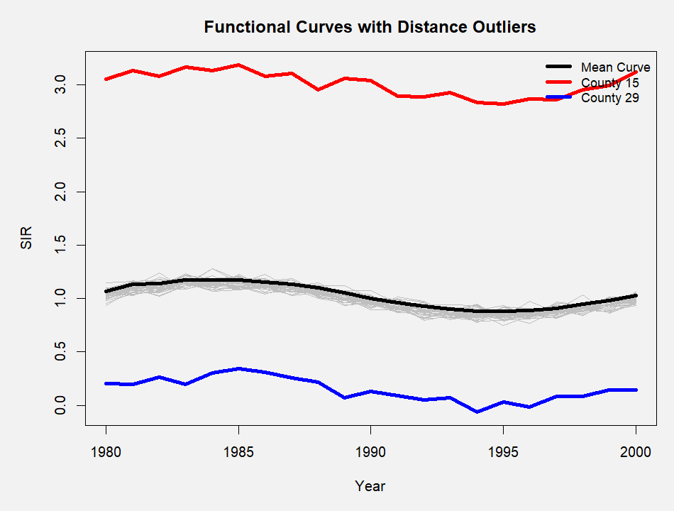{width="100%"}

Illustration of distance-based outlier curves.
:::
::::

:::: {.column width="50%"}
::: fragment
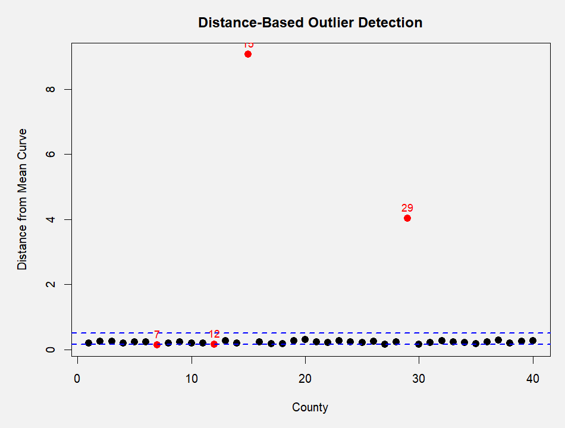{width="100%"}

Distance values used to identify outlying curves.
:::
::::
:::::::

##  {background-color="#000000"}

::: {style="height:80vh; display:flex; justify-content:center; align-items:center; font-size:64px; font-weight:700; color:white; letter-spacing:2px;"}
Methods to Detect Outliers
:::

# Methods Used

::: incremental
1.  **SVTT Method using SaTScan**

2.  **Functional Box-Plot**

3.  **Trend-Based Outliers**

    -   Linear Trend Outliers

4.  **Distance-Based Method**

5.  **Depth-Based Method**

6.  **Functional Depth**

7.  **MUOD**\
    *(Massive Unsupervised Outlier Detection)*
:::

## 1. Spatial Variation in Temporal Trends (SVTT)

::: incremental
-   Detects regions with unusual temporal trends.

-   Compares trends inside and outside a spatial window.

-   Implemented in **SaTScan** using the **Discrete Poisson Model**.

-   Types:

    -   Linear SVTT
    -   Quadratic SVTT

$$
H_0:\text{Trend}_{in}=\text{Trend}_{out}
$$

$$
H_1:\text{Trend}_{in}\neq \text{Trend}_{out}
$$
:::

[@MoragaKulldorff2016; @kulldorff2022satscan]

## 2. Functional Box-Plot

::: incremental
-   Extension of the classical boxplot for functional data.

-   Summarizes an entire collection of curves using functional depth.

-   Displays:

    -   Median curve
    -   Central region
    -   Envelope
    -   Functional outliers

-   Provides an overall visualization of variability and outlying behavior in functional data.
:::

[@Sun2011FunctionalBoxplots]

------------------------------------------------------------------------

## 2. Functional Boxplot Illustration

::: fragment
{width="80%" fig-align="center"}
:::

## 2. Trend-Based Outliers

::::::::: {style="font-size:0.58em; line-height:1.08;"}
::: fragment
Let

$$
y_1(t), y_2(t), \ldots, y_k(t)
$$

denote the temporal functions of $k$ regions observed at time points

$$
t_1, t_2, \ldots, t_n.
$$
:::

::: fragment
### Algorithm
:::

::: fragment
**Step 1:**\
Fit a suitable trend model separately for each region using a small number of parameters, such as Linear, Quadratic, and Exponential trends.
:::

::: fragment
For example, a linear trend model may be written as

$$
y_i(t)=\beta_{0i}+\beta_{1i}t+\varepsilon_i(t),
$$

where $\beta_{0i}$ and $\beta_{1i}$ represent the trend parameters for region $i$.
:::

::: fragment
**Step 2:**\
Treat the estimated parameter vectors

$$
(\hat{\beta}_{0i}, \hat{\beta}_{1i})
$$

as observations in lower-dimensional space and apply standard outlier detection techniques.
:::

::: fragment
**Step 3:**\
Regions whose parameter vectors are detected as unusual are identified as trend-based outliers.
:::
:::::::::

## 3. Distance-Based Outliers

::::::::: {style="font-size:0.58em; line-height:1.08;"}
::: fragment
Let

$$
y_1(t), y_2(t), \ldots, y_k(t)
$$

denote the temporal functions of $k$ regions observed at time points

$$
t_1, t_2, \ldots, t_n.
$$
:::

::: fragment
### Algorithm
:::

::: fragment
**Step 1:**\
Compute the distance between each curve and a central curve, such as the mean or median curve.
:::

::: fragment
For example, the Euclidean distance between curve $y_i(t)$ and the central curve $c(t)$ is

$$
d_i=
\sqrt{
\sum_{j=1}^{n}
\left(
y_i(t_j)-c(t_j)
\right)^2
}.
$$
:::

::: fragment
**Step 2:**\
Use the obtained distances as one-dimensional observations and apply standard outlier detection methods.
:::

::: fragment
**Step 3:**\
Curves having unusually large distances from the central curve are identified as distance-based outliers.
:::
:::::::::

## 3. Commonly Used Distance Measures

::::::: {style="font-size:0.58em; line-height:1.08;"}
::: fragment
### Euclidean Distance

$$
d(x,y)=
\sqrt{
\sum_{i=1}^{n}(x_i-y_i)^2
}
$$
:::

::: fragment
### Manhattan Distance

$$
d(x,y)=
\sum_{i=1}^{n}|x_i-y_i|
$$
:::

::: fragment
### Mahalanobis Distance

$$
d(x,y)=
\sqrt{
(x-y)^\top \Sigma^{-1}(x-y)
}
$$
:::

::: fragment
### Cosine Distance

$$
d(x,y)=
1-
\frac{x^\top y}
{\|x\|\|y\|}
$$
:::
:::::::

## 4. Depth-Based Outliers

::::::::: {style="font-size:0.58em; line-height:1.08;"}
::: fragment
Let

$$
y_1(t), y_2(t), \ldots, y_k(t)
$$

denote the temporal functions of $k$ regions observed at time points

$$
t_1, t_2, \ldots, t_n.
$$
:::

::: fragment
### Algorithm
:::

::: fragment
**Step 1:**\
Compute a depth value for each curve, which measures the centrality of the curve relative to the remaining curves.
:::

::: fragment
A general depth function may be written as

$$
D(y_i \mid Y),
$$

where $Y=\{y_1,y_2,\ldots,y_k\}$ denotes the collection of all curves.
:::

::: fragment
**Step 2:**\
Use the obtained depth values as one-dimensional observations and apply standard outlier detection methods.
:::

::: fragment
**Step 3:**\
Curves with unusually small depth values are identified as depth-based outliers.
:::
:::::::::

## Commonly Used Depth Measures

::::::::::: {style="font-size:0.58em; line-height:1.08;"}
::: fragment
### Mahalanobis Depth

$$
D_M(x)=
\frac{
1
}{
1+(x-\mu)^\top\Sigma^{-1}(x-\mu)
}
$$
:::

::: fragment
### Spatial Depth

$$
D_S(x)=
1-
\left\|
\frac{1}{n}
\sum_{i=1}^{n}
\frac{x-X_i}{\|x-X_i\|}
\right\|
$$
:::

::: fragment
### Tukey Depth

$$
D_T(x)=
\inf_{u\in S^{d-1}}
P(u^\top X \le u^\top x)
$$
:::

::::::: fragment
### Modified Band Depth (MBD)

$$
\text{MBD}(x)=
\binom{n}{2}^{-1}
\sum_{i<j}
\frac{
\lambda(A(x;x_i,x_j))
}{
\lambda(T)
}
$$

:::::: {style="font-size:0.50em; line-height:1.0;"}
::::: {style="display:flex; gap:40px;"}
::: {style="width:50%;"}
-   $A(x;x_i,x_j)$ : set where $x(t)$ lies inside the band formed by $x_i(t)$ and $x_j(t)$

-   $\lambda(\cdot)$ : Lebesgue measure

-   $T$ : observation time domain
:::

::: {style="width:50%;"}
-   $X$ : random vector

-   $u$ : projection direction

-   $S^{d-1}$ : unit sphere in $\mathbb{R}^d$
:::
:::::
::::::
:::::::
:::::::::::

##  {background-color="#000000"}

::: {style="height:80vh; display:flex; justify-content:center; align-items:center; font-size:64px; font-weight:700; color:white; letter-spacing:2px;"}
Simulation Study Results
:::


## Simulation Data Generation

:::::::::: {style="font-size:0.62em; line-height:1.15;"}

::: fragment
Synthetic datasets were generated under different temporal trend scenarios to evaluate the performance of the proposed outlier detection methods.
:::

::: fragment
For each spatial unit \(i=1,\ldots,n\) and time point \(t=1,\ldots,T\),

$$
Y_{it}\sim \text{Poisson}(\lambda_{it}),
$$

where

$$
\lambda_{it}=E_{it}\theta_{it}.
$$
:::

::: fragment
The expected number of cases was assumed constant across space and time:

$$
E_{it}=100.
$$
:::


::: fragment
Both single-cluster and multiple-cluster settings were considered to assess the robustness of each method under varying spatial configurations.
:::

::: fragment
The standardized incidence ratio (SIR) for each county and time point was computed as:

$$
SIR_{it}=\frac{Y_{it}}{E_{it}}.
$$
:::

::::::::::


---

## Hypothetical Study Region

```{=html}
<div style="display:flex; justify-content:center; align-items:center; height:78vh;">
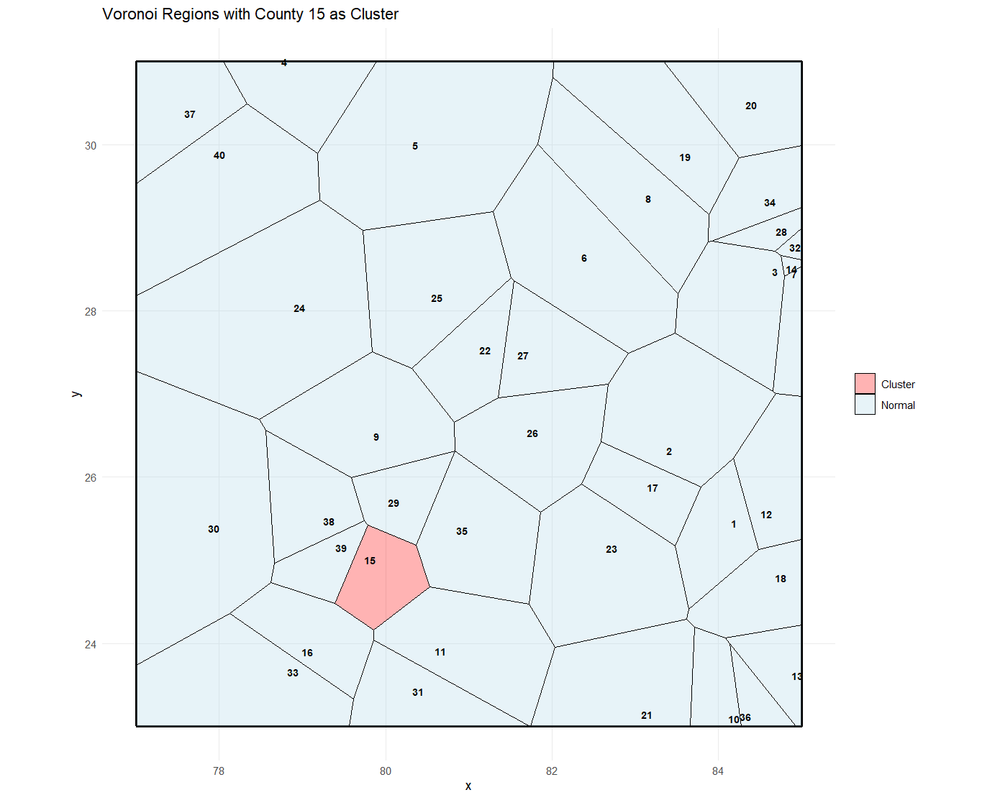
</div>

```


## Hypothetical Study Region

::: {style="font-size:0.6em; line-height:1.4;"}

- A hypothetical spatial region consisting of **40 counties** was generated using Voronoi tessellation.

- Spatial locations were sam$ to $31^\circ$

- The study period spans from:

$$
1980 \text{ to } 2000
$$

corresponding to:

$$
21 \text{ yearly time points}
$$

- For simplicity, the population was assumed constant across all counties and years:

$$
Population = 10{,}000
$$

- Let

$$
i = 1,2,\ldots,40
$$

denote counties, and

$$
t = 1,2,\ldots,21
$$

denote the yearly time index.

:::

## Simulated Temporal Trends

:::::::::::: {style="font-size:0.55em;"}
::::::: fragment
:::::: {style="display:flex; justify-content:space-between; gap:15px;"}
::: {style="width:32%; text-align:center;"}
{width="100%"}

Parabolic Trends
:::

::: {style="width:32%; text-align:center;"}
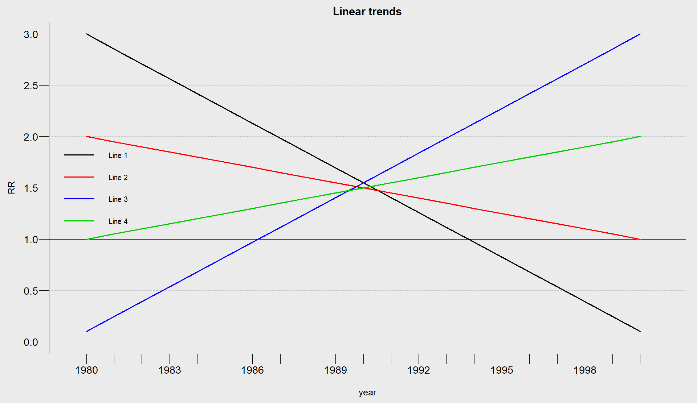{width="100%"}

Linear Trends
:::

::: {style="width:32%; text-align:center;"}
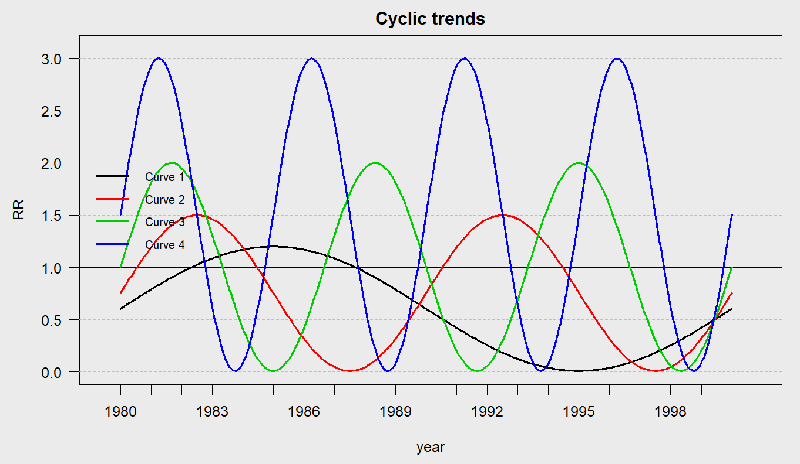{width="100%"}

Cyclic Trends
:::
::::::
:::::::

<br>

:::::: fragment
::::: {style="display:flex; justify-content:center; gap:35px;"}
::: {style="width:32%; text-align:center;"}
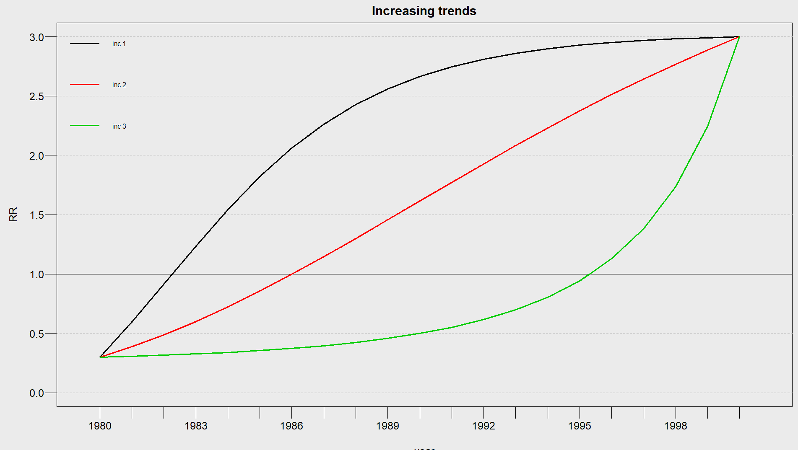{width="100%"}

Increasing Trends
:::

::: {style="width:32%; text-align:center;"}
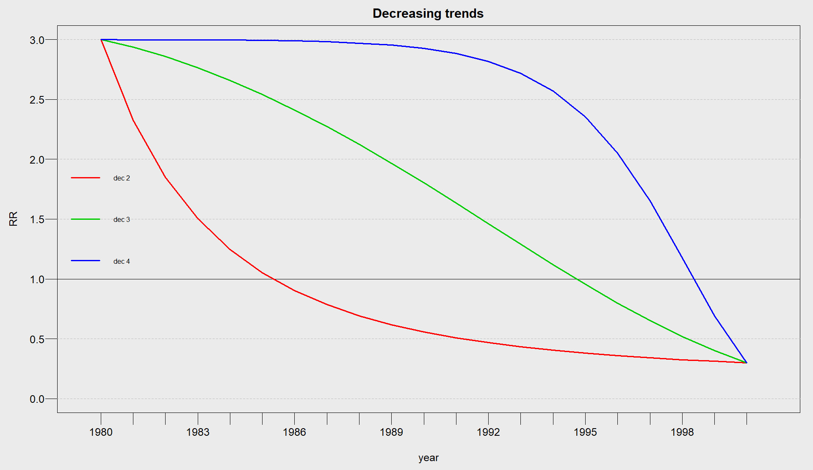{width="100%"}

Decreasing Trends
:::
:::::
::::::
::::::::::::

## Metrics Used for Analysis

:::::::::::::: {style="font-size:0.50em; line-height:1.08;"}
::::::::::::: {style="display:flex; gap:40px;"}
::::::: {style="width:50%;"}
::: fragment
### Sensitivity

$$
\text{Sensitivity}=
\frac{TP}{TP+FN}
$$

Proportion of true outliers correctly identified.
:::

::: fragment
### Specificity

$$
\text{Specificity}=
\frac{TN}{TN+FP}
$$

Proportion of normal observations correctly identified.
:::

::: fragment
### Positive Predictive Value (PPV)

$$
\text{PPV}=
\frac{TP}{TP+FP}
$$

Proportion of detected outliers that are truly outliers.
:::

::: fragment
### Purity

$$
\text{Purity}=
\frac{1}{N}\sum_k \max_j |c_k \cap t_j|
$$

Measures homogeneity within detected groups.
:::
:::::::

::::::: {style="width:50%;"}
::: fragment
### Rand Index (RI)

$$
RI=
\frac{TP+TN}{TP+TN+FP+FN}
$$

Measures similarity between true and detected classifications.
:::

::: fragment
### Adjusted Rand Index (ARI)

$$
ARI=
\frac{RI-\mathbb{E}(RI)}
{\max(RI)-\mathbb{E}(RI)}
$$

Chance-adjusted version of RI.
:::

::: fragment
### Jaccard Index

$$
J=
\frac{TP}{TP+FP+FN}
$$

Measures overlap between detected and true outlier sets.
:::

::: fragment
### Computation Time

Average time required to perform outlier detection for 1 dataset.
:::
:::::::
:::::::::::::
::::::::::::::

## Sensitivity Heatmap

```{=html}
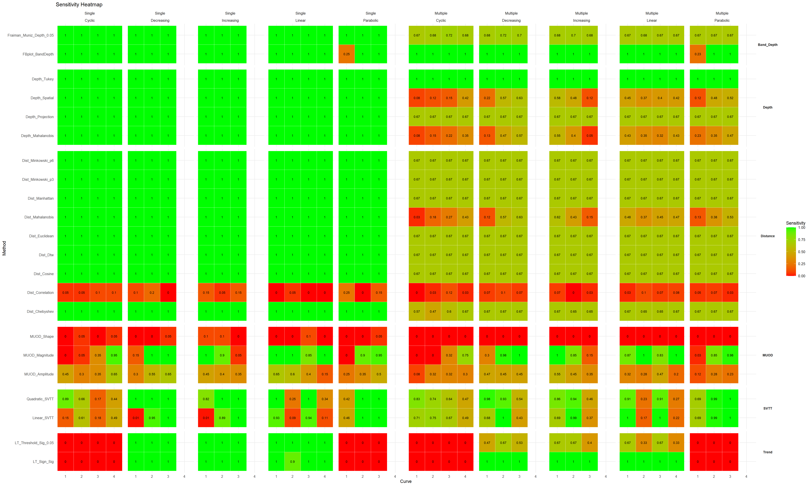
```

------------------------------------------------------------------------

## Specificity Heatmap

```{=html}
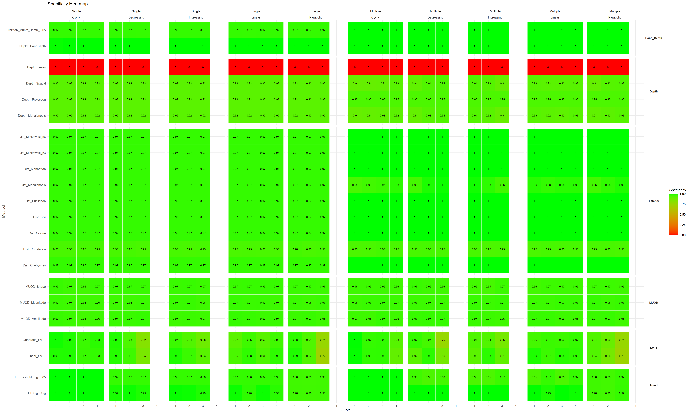
```

------------------------------------------------------------------------

## PPV Heatmap

```{=html}
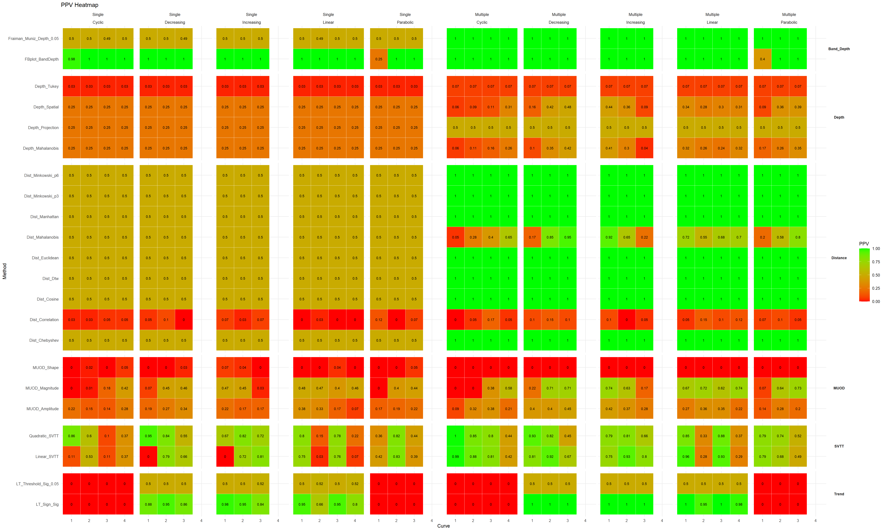
```

------------------------------------------------------------------------

## Purity Heatmap

```{=html}
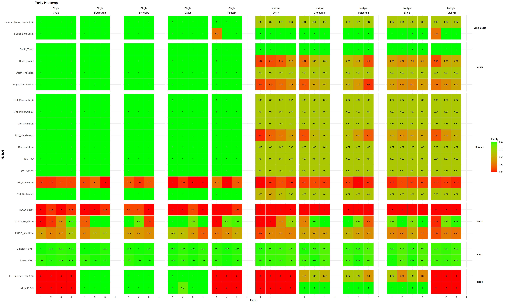
```

------------------------------------------------------------------------

## ARI Heatmap

```{=html}
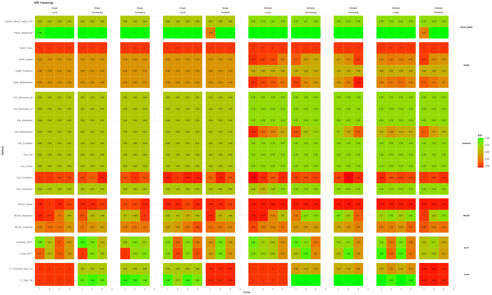
```

------------------------------------------------------------------------

## RI Heatmap

```{=html}
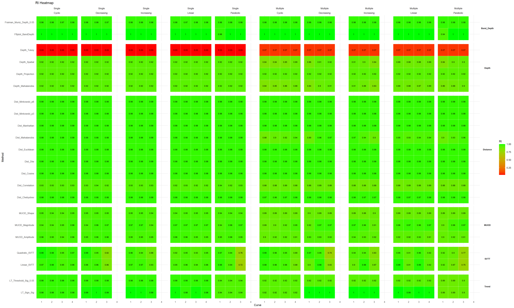
```

------------------------------------------------------------------------

## Jaccard Heatmap

```{=html}
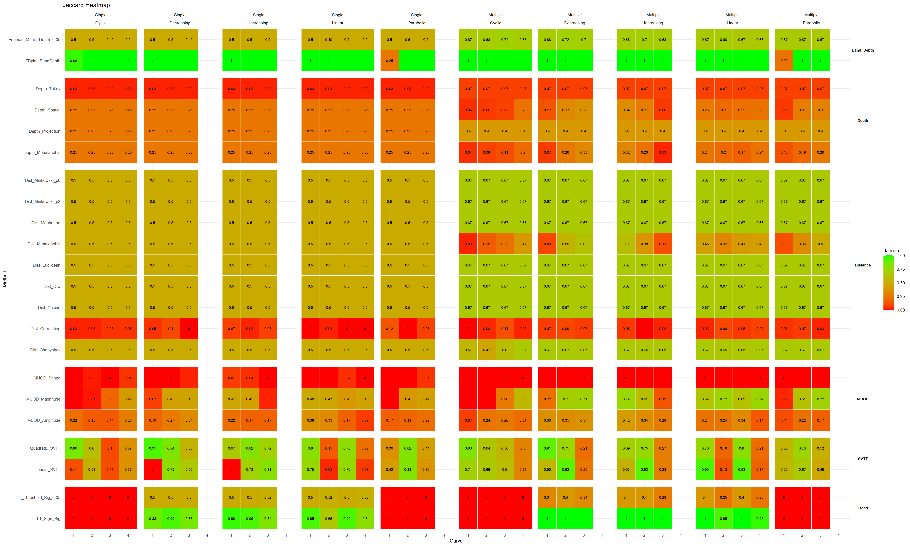
```

------------------------------------------------------------------------

## Computational Time Heatmap

```{=html}
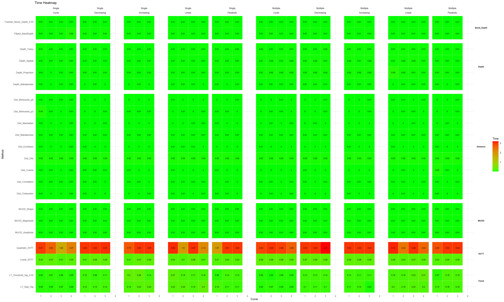
```


##  {background-color="#000000"}

::: {style="height:80vh; display:flex; justify-content:center; align-items:center; font-size:64px; font-weight:700; color:white; letter-spacing:2px;"}
Application On Real Dataset
:::


## Dengue Dataset

:::: {.columns}

::: {.column width="45%"}

<div style="font-size:0.70em; line-height:1.25;">

**Data Source**

- Dengue incidence data were obtained from the publicly archived **Info Dengue** database.

- The dataset provides weekly dengue case counts for all municipalities in São Paulo, Brazil.

- Data source:  
  https://info.dengue.mat.br/api

- Study period:  
  **1 April 2021 – 1 April 2024**

</div>

:::

::: {.column width="55%"}

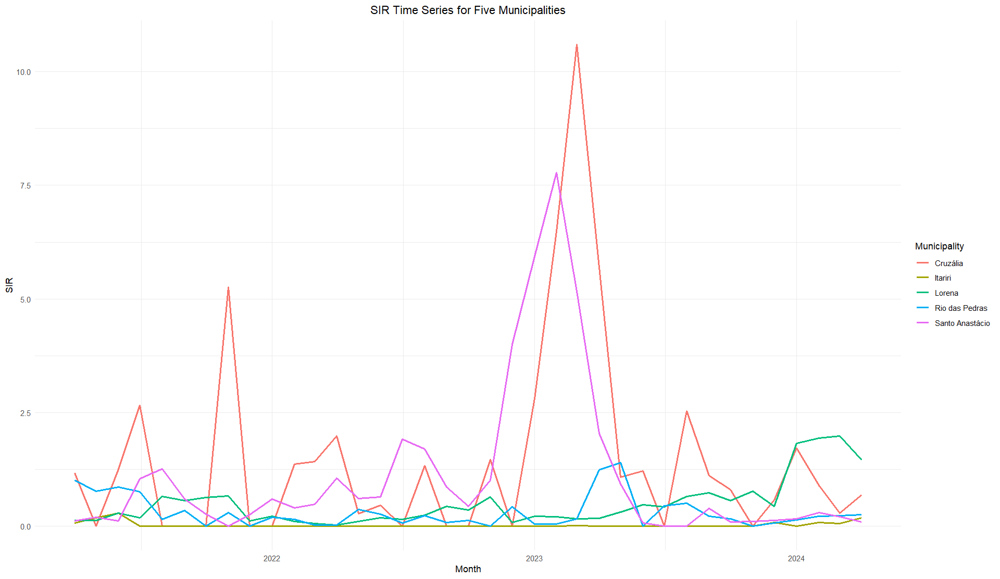{width=100%}

<div style="font-size:0.42em; text-align:center;">
SIR during Apr-2021 to Apr-2024
</div>

:::

::::

------------------------------------------------------------------------


## 1.1 SVTT Linear Analysis: Time Series

:::: {.columns}

::: {.column width="48%"}
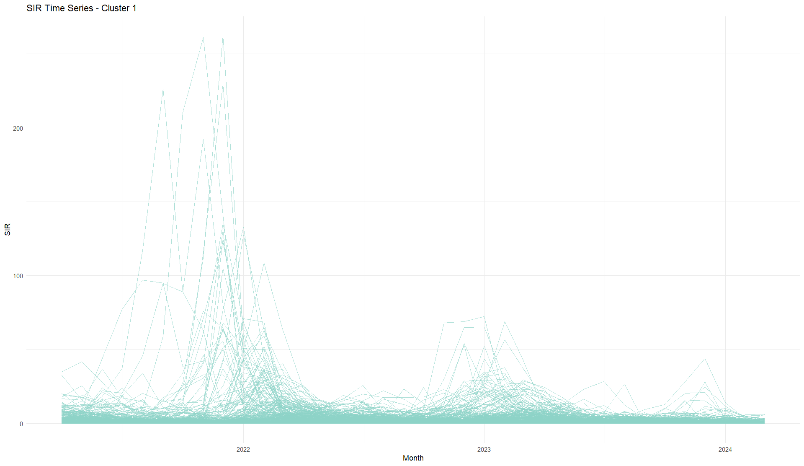{width=86%}

<div style="font-size:0.45em; text-align:center;">
Cluster 1 TS
</div>
:::

::: {.column width="48%"}
{width=86%}

<div style="font-size:0.45em; text-align:center;">
Cluster 2 TS
</div>
:::

::::

\vspace{-0.35cm}

:::: {.columns}

::: {.column width="27%"}
:::

::: {.column width="46%"}
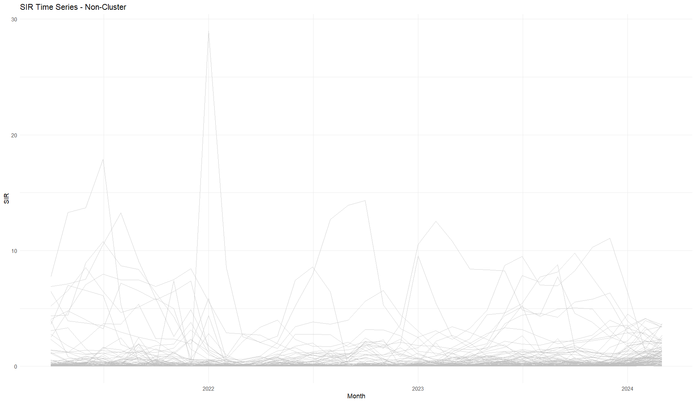{width=76%}

<div style="font-size:0.45em; text-align:center;">
Non-Cluster TS
</div>
:::

::: {.column width="27%"}
:::

::::


## 1.1 SVTT Linear Analysis: Spatial Pattern and Trend

:::: {.columns}

::: {.column width="50%"}
{width=100%}

\small Spatial Clusters Map
:::

::: {.column width="50%"}
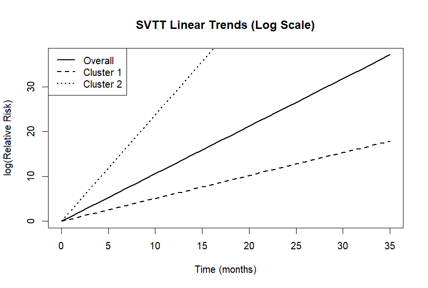{width=100%}

\small Fitted Linear Trend
:::

::::


## 1.2 SVTT Quadratic Analysis: Time Series

:::: {.columns}

::: {.column width="48%"}
{width=86%}

<div style="font-size:0.45em; text-align:center;">
Cluster 1 TS
</div>
:::

::: {.column width="48%"}
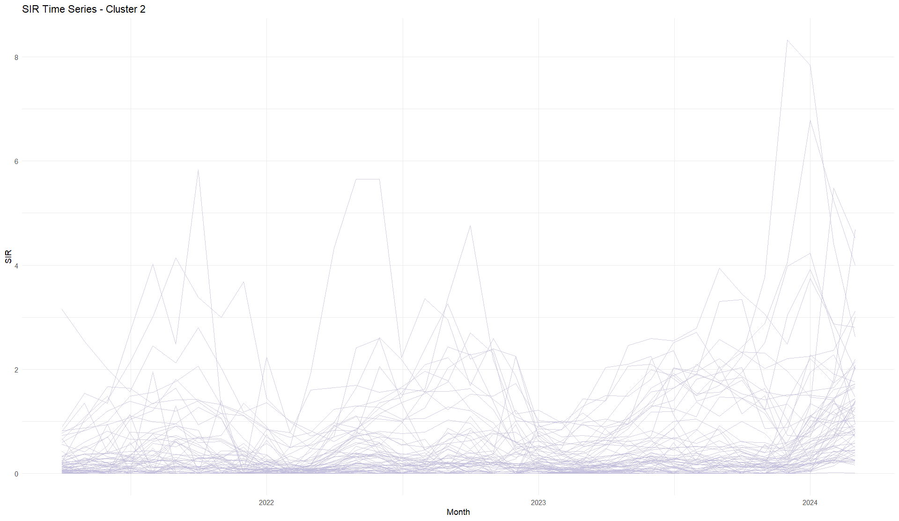{width=86%}

<div style="font-size:0.45em; text-align:center;">
Cluster 2 TS
</div>
:::

::::

\vspace{-0.35cm}

:::: {.columns}

::: {.column width="27%"}
:::

::: {.column width="46%"}
{width=76%}

<div style="font-size:0.45em; text-align:center;">
Non-Cluster TS
</div>
:::

::: {.column width="27%"}
:::

::::


## 1.2 SVTT Quadratic Analysis: Spatial Pattern and Trend

:::: {.columns}

::: {.column width="49%"}
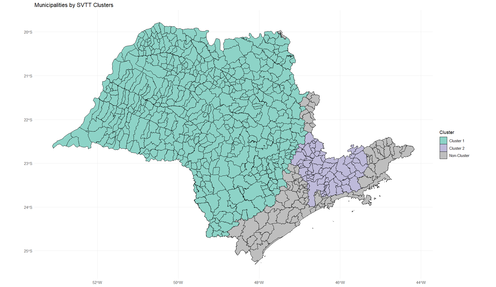{width=92%}

\small Spatial Clusters Map
:::

::: {.column width="49%"}
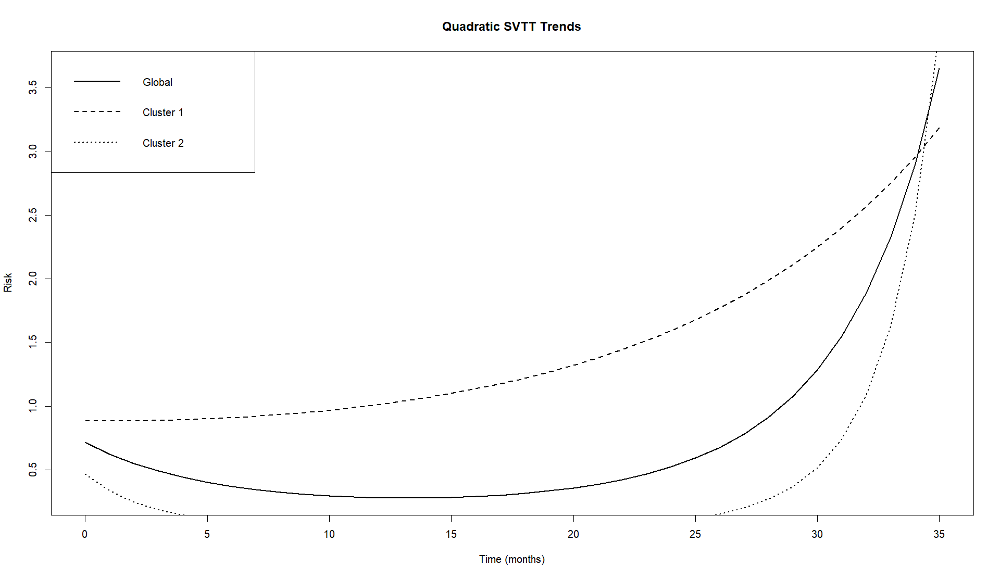{width=92%}

\small Fitted Quadratic Trend
:::

::::


## 2. Functional Boxplot Summary

```{=html}
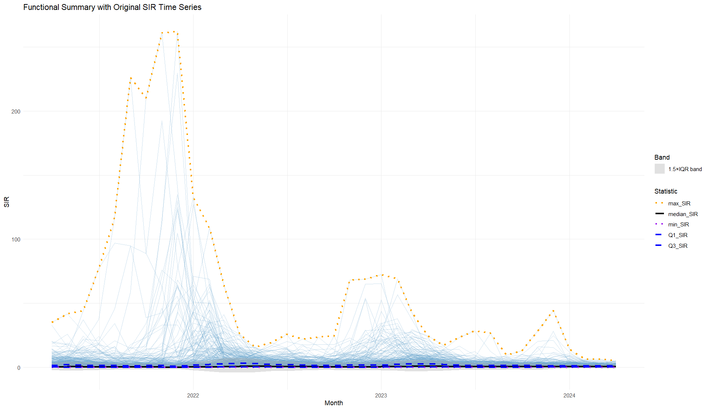
```

<div style="font-size:0.55em; text-align:center; margin-top:8px;">
Min, Max, Median, Q1, and Q3 curves.
</div>

------------------------------------------------------------------------

## 2. Functional Boxplot Summary

```{=html}
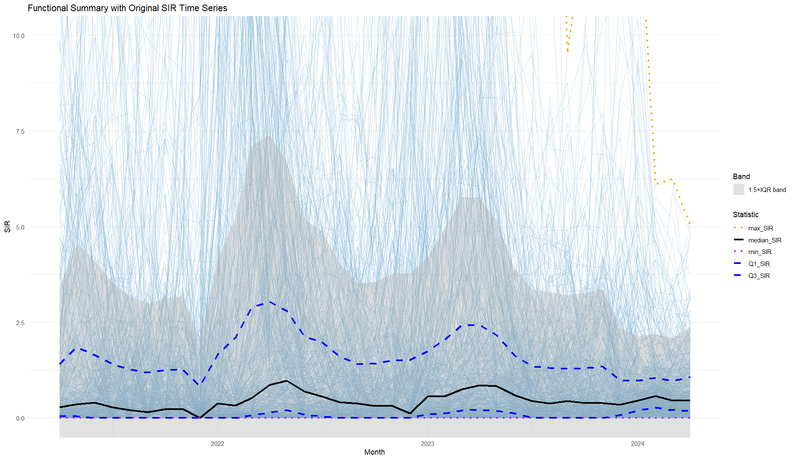
```

<div style="font-size:0.55em; text-align:center; margin-top:8px;">
Min, Q1, Median, and Q3 curves with reduced y-axis.
</div>

------------------------------------------------------------------------


## 3.1Linear Trend Outliers: Spatial Map

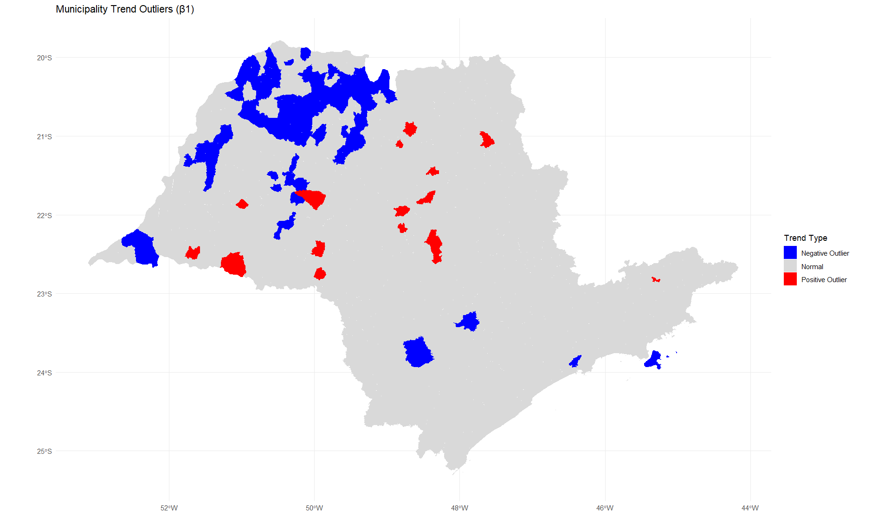{width=82%}

<div style="font-size:0.45em; text-align:center;">
Map of Linear Trend Outliers
</div>


## 3.1 Positive Linear Trend Outliers

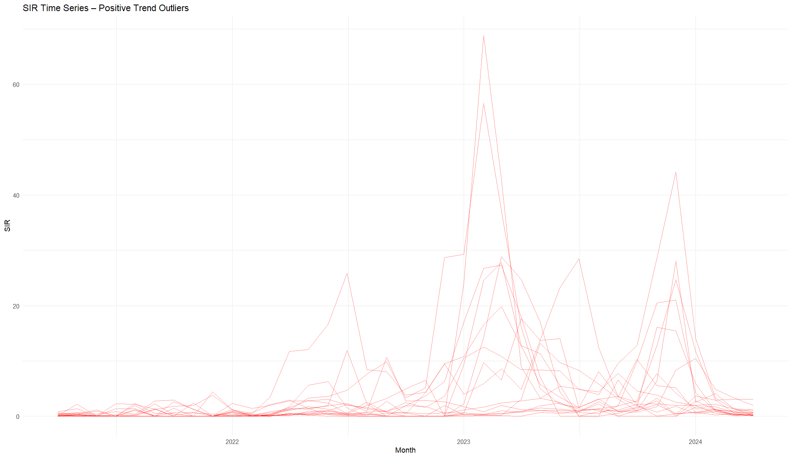{width=82%}

<div style="font-size:0.45em; text-align:center;">
Positive Linear Trend Outliers
</div>


## 3.1 Negative Linear Trend Outliers

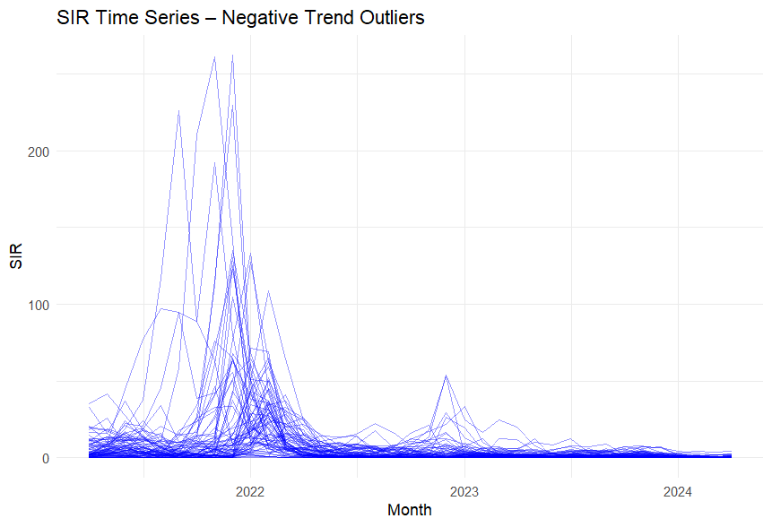{width=82%}

<div style="font-size:0.45em; text-align:center;">
Negative Linear Trend Outliers
</div>


## 3.1  Normal Linear Trend Time Series

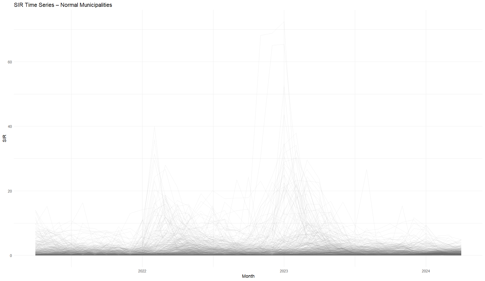{width=82%}

<div style="font-size:0.45em; text-align:center;">
Normal Linear Trend Time Series
</div>


## 4. Distribution of DBM Statistics


<br><br>

:::: {.columns}

::: {.column width="49%"}
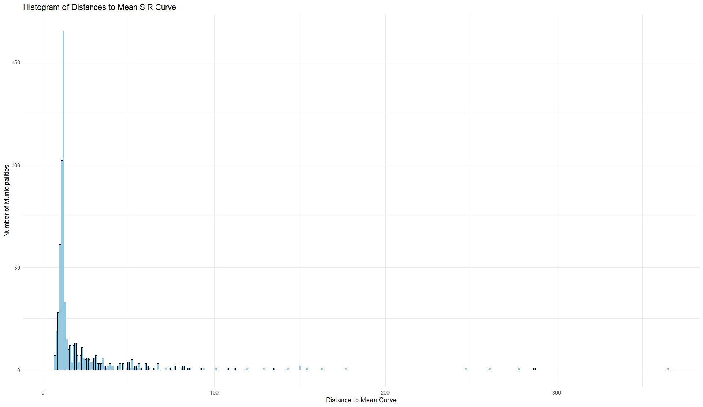{width=98%}

<div style="font-size:0.45em; text-align:center;">
Histogram of Mean DBM
</div>
:::

::: {.column width="49%"}
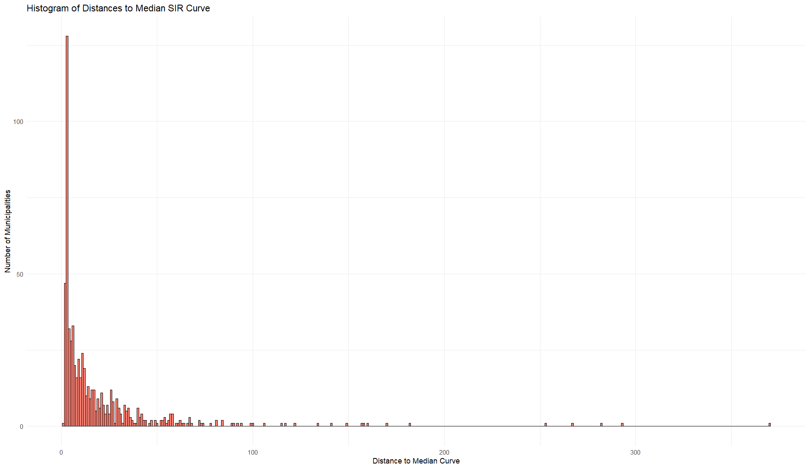{width=98%}

<div style="font-size:0.45em; text-align:center;">
Histogram of Median DBM
</div>
:::

::::
## 4. DBM Outlier Maps

<br><br>

:::: {.columns}

::: {.column width="33%"}

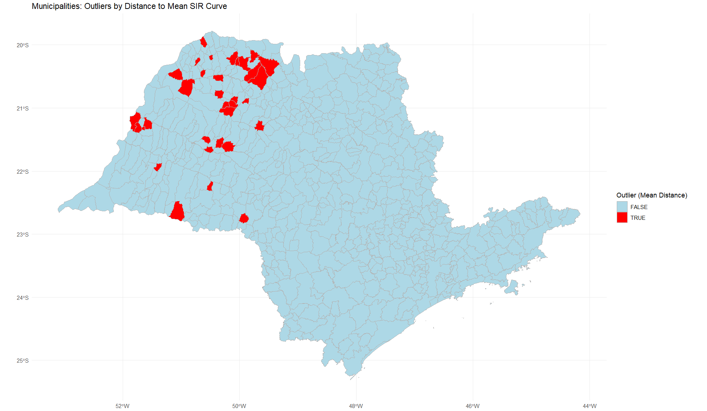{width=125%}

<div style="font-size:0.42em; text-align:center; margin-top:10px;">
Mean Outliers Map
</div>

:::

::: {.column width="33%"}

{width=125%}

<div style="font-size:0.42em; text-align:center; margin-top:10px;">
Median Outliers Map
</div>

:::

::: {.column width="33%"}

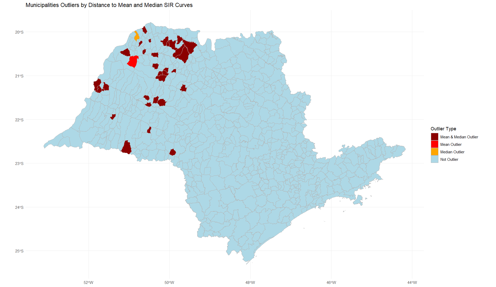{width=125%}

<div style="font-size:0.42em; text-align:center; margin-top:10px;">
Combined Mean–Median Map
</div>

:::

::::


## 4. Mean DBM Time-Series

<br><br>

:::: {.columns}

::: {.column width="33%"}

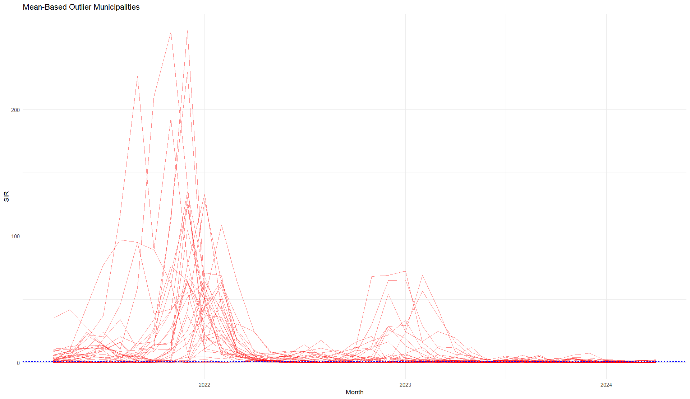{width=125%}

<div style="font-size:0.42em; text-align:center; margin-top:10px;">
Mean Outliers Time-Series
</div>

:::

::: {.column width="33%"}

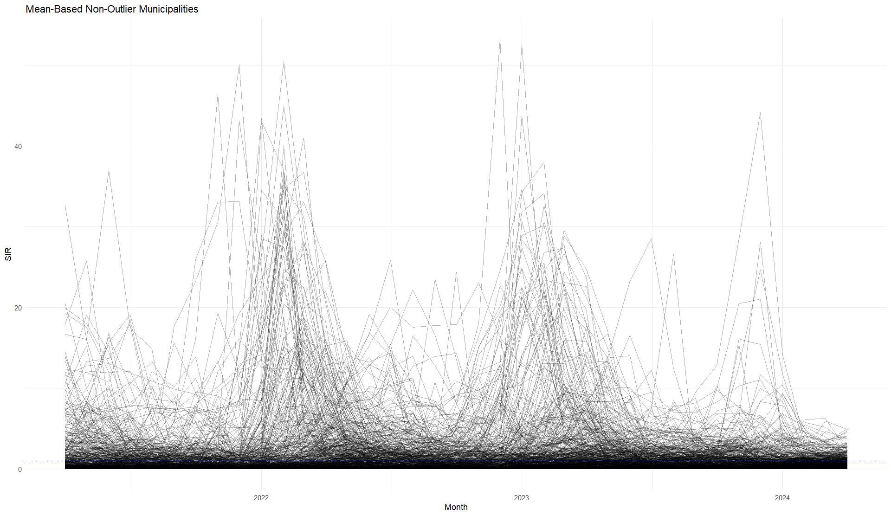{width=125%}

<div style="font-size:0.42em; text-align:center; margin-top:10px;">
Mean Non-Outliers Time-Series
</div>

:::

::: {.column width="33%"}

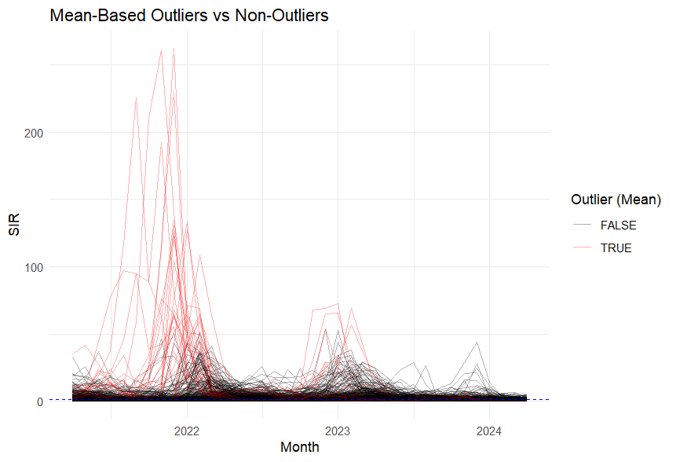{width=125%}

<div style="font-size:0.42em; text-align:center; margin-top:10px;">
Mean Overall Time-Series
</div>

:::

::::


## 4. Median DBM Time-Series

<br><br>

:::: {.columns}

::: {.column width="33%"}

{width=125%}

<div style="font-size:0.42em; text-align:center; margin-top:10px;">
Median Outliers Time-Series
</div>

:::

::: {.column width="33%"}

{width=125%}

<div style="font-size:0.42em; text-align:center; margin-top:10px;">
Median Non-Outlier Time-Series
</div>

:::

::: {.column width="33%"}

{width=125%}

<div style="font-size:0.42em; text-align:center; margin-top:10px;">
Median Overall Time-Series
</div>

:::

::::


##  {background-color="#000000"}

:::::::::: {style="position:relative; height:80vh; color:white; font-weight:700; overflow:hidden;"}
::: {style="position:absolute; top:34%; left:50%; transform:translate(-50%,-50%); font-size:92px; color:#FFFFFF; letter-spacing:2px;"}
Thank You
:::

::: {style="position:absolute; top:12%; left:8%; font-size:68px; color:#FFD700; transform:rotate(14deg);"}
धन्यवाद
:::

::: {style="position:absolute; top:14%; right:8%; font-size:58px; color:#87CEFA; transform:rotate(-12deg);"}
شکریہ
:::

::: {style="position:absolute; top:58%; left:10%; font-size:56px; color:#90EE90; transform:rotate(10deg);"}
ধন্যবাদ
:::

::: {style="position:absolute; top:56%; right:10%; font-size:50px; color:#FFB6C1; transform:rotate(-16deg);"}
شكراً
:::

::: {style="position:absolute; bottom:12%; left:34%; font-size:46px; color:#FFA07A; transform:rotate(15deg);"}
Gracias
:::

::: {style="position:absolute; bottom:10%; right:14%; font-size:40px; color:#DDA0DD; transform:rotate(-10deg);"}
धन्यवाद!
:::
::::::::::

------------------------------------------------------------------------

# References

::: {#refs}
:::
